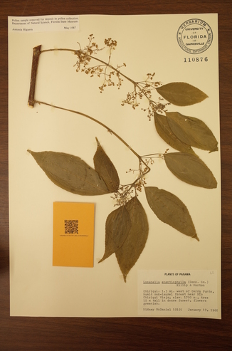

# Phylogenomic discovery and engineering of nitrogen fixation into the bioenergy woody crop poplar

- [Background](#Background)
- [Installation](#Installation)
- [How to Run](#How-to-Run)
- [Sample Selection Report](#Sample-Selection-Report)
    - [Sample Collection](#Sample-Collection)
    - [Ingest Image Data](#Ingest-Image-Data)
    - [Ingest Taxonomic Data](#Ingest-Taxonomic-Data)
    - [Ingest Miscellaneous Data](#Ingest-Miscellaneous-Data)
    - [Repair Sample IDs](#Repair-Sample-IDs)
    - [Ingest Sequencing Data](#Ingest-Sequencing-Data)
    - [Sample Selection Report](#Sample-Selection-Report)

# Background

This project starts with extracting physical samples from herbarium samples. We then extract DNA from those samples and sequence the DNA. We then use various techniques to analyze the DNA (not in this repository).

This system repository contains the scripts for tracking the data through the process. It is a light-weight Laboratory Management System (LIMS) for handling project data **related to this particular project**. It consists of 4 major components as well as numerous minor components.

First, the central component is an SQLite3 database. This is where most of the data is stored. The general design is to ingest all of the raw data, typically Google Sheets, into the database as close as possible to the original format. The raw data is then processed, error corrected, merged, etc. into a usable format. For instance, we ingest a couple of different taxonomies from different labs, so the raw taxonomies are imported into the database as is and then they are merged into a single error corrected and deduplicated taxonomy that is used for further processing.

To prevent this from being a chaotic pile of data, we have a few key values that are tracked through the system and for which we enforce data integrity. The primary key field is the sample ID, a UUID for each sample. It is used to track data from the image from the initial imaging, to DNA extraction, through DNA sequencing. Other important key fields are the taxonomic name and any external IDs assigned by other organizations.

The second central component is made up of the Python scripts that perform the actual processing on the data. Most of the scripts form the backbone of the ingestion and reporting process. They are organized into a Makefile which groups them into sets of scripts. One set is for scripts that scan images for QR-code that are used as sample IDs. Another set is for the ingestion and auditing of the taxonomic data. And so on.

The third major component is made up the JavaScript (Google Apps) Scripts attached to Google Sheets to streamline and audit the data as it is being entered into worksheets. These catch errors, like duplicate sample IDs before they are ingested into the database. There are also templates (macros) for creating structures for data entry, for example for entering 96-well plate data -- i.e. which sample IDs are placed into what wells. Data like this is typically entered using QR-Code or barcode readers.

And the fourth major component is the reporting system. The strategy here was to create standalone interactive HTML reports and CSV files. The HTML reports are single file reports that can be distributed to scientists without using an HTML server. They are used to search, filter, and examine the data. The CSV version of the reports allow scientists to perform their own analyses on the data.

# Installation

You will need to have Python3 installed, as well as pip, a package manager for python. Run the following code:

```
git clone https://github.com/rafelafrance/nitfix.git
cd path/to/cloned/nitfix
python3 -m pip install -r requirements.txt
```

If you plan on scanning the images for QR-codes, you will also need to install the zbar library for both zbarlight and zbar-py. In Ubuntu Linux you would:
```
sudo apt install libzbar-dev libzbar0
```

We also need to install some Google Scripts (a variant of JavaScript) for the various Google sheets that are used for data entry. The script are in the [google_sheets](google_sheets) directory. You can copy the appropriate script into the sheets' script editor. See [Google's instructions](https://developers.google.com/apps-script/guides/sheets) for a description of how to do this.

- The nitFixMasterTaxonomy.gs script is used to make sure that we do not enter duplicate UUIDs into the worksheet that tracks the taxonomy.
- The plate_generator.gs is used to generate the 96-well plate templates in the for the initial extraction of the DNA from the samples. It also performs some sanity checks on the data like looking for duplicate UUIDs. As well as proper tabbing for filling in the well data.

# How to Run

As mentioned above, this repository contains a set of scripts that are tailored to this specific project. We do not expect that these scripts will be useful for your project as is but you should be able to use some scripts or parts of scripts with, hopefully minimal modifications.

**NOTE We use the Makefile for running scripts in sequence and NOT for setting up the environment.**

### Sample Collection
We gather physical samples from the herbarium specimens. We print UUIDs on sample envelopes and we take a picture of the herbarium sample with its collection envelope. Most of this step is not handled by scripts in this repository.
1. The printing of the envelopes is not done any script here but the generation of the UUIDs is done by the trivial script [print_uuids.py](nitfix/print_uuids.py).
1. Then you take a picture of the herbarium sample with its envelope like so: 
1. The researcher who took the picture also enters the UUID into the taxonomic Google spreadsheet. This is done with a QR-code reader which is not a part of this repository.
1. The samples themselves are sent to the wet lab for DNA extraction. We need to track the samples through the system.

### Ingest Image Data
`make image` Will run steps 2-4.
1. Images from the cameras are downloaded. We're using Dropbox for storing and sharing the mages.
2. The primary script here is the `python nitfix/ingest_images.py` script. This script scans a downloaded image for the QR-code and links the image to the data in the taxonomy worksheet.
3. `python nitfix/ingest_pilot_data.py` loads data from the pilot NitFix study.
4. `python nitfix/ingest_corrales_data.py` loads data from an alternative data source.

### Ingest Taxonomic Data
`make taxonomy` Will run the following 2 steps.
1. `python nitfix/ingest_taxonomies.py` download and ingest the taxonomies. We have two labs with their own taxonomy worksheets, these need to be merged and reconciled into the database.
2. `python nitfix/audit_taxonomy.py` will look for errors in the merged taxonomies. When it finds an error it will log the error to a separate table and either fix the error if possible or remove the offending sample from the rest of the workflow. Errors include:
    - Duplicate sample IDs (UUIDs).
    - Bad genera.

### Ingest Miscellaneous Data
`make other` Will run a series of scripts that collect data for reporting and other purposes.
1. `python nitfix/ingest_loci_data.py` ingests data that contains genbank loci that are important for nodulation.
1. `python nitfix/ingest_sprent_data.py` ingests nodulation data from Sprent et al.
1. `python nitfix/ingest_non_fabales_data.py` ingests nodulation dataset. 
1. `python nitfix/ingest_werner_data.py` ingests nodulation data from Werner et al.
1. `python nitfix/ingest_nfn_data.py` ingests data gathered from Notes from Nature crowd sourced data entry. These expeditions gather information, typically (but not exclusively) from the label on the herbarium sheet.
1. `python nitfix/ingest_priority_taxa.py` ingests the taxa that team researchers deemed most important to the NitFix project.

### Repair Sample IDs
`make repair` ties to fix sample IDs.
- There are various sources of bad sample IDs. Some of which we can fix and
others we cannot or at least cannot without a great deal of effort.
    - Bar reader machines sometimes read a QR-Code or barcode incorrectly for whatever reason. This is fixable if we can trace the code back to what it is supposed to be.
    - Double printing of QR-code envelopes. Without meaningful codes -- vs. the UUIDs we're using now -- fixing them will be extremely difficult. One possible improvement here would be to add information about the museum, date, and who took the pictures to the sample ID. Hindsight being 20/20. This would make back tracing the issues a little bit easier. FYI: I did add checks to Google sheets to combat this particular error but they slowed data entry and people turned off or ignored these safeguards.
- Missing sample IDs. We fix them when possible. Someone forgets to log the
   sample ID into the master taxonomy.
- Sample IDs in the master taxonomy without a corresponding picture. The
   actual sample may still exist.
- Actions, given a manual set of corrections:
    - Add them to the taxonomy_ids table as if the "bad" sample ID was
       already entered into the taxonomy table manually.
    - Adjust the images table to use the new "bad" sample ID.
    
### Ingest Sequencing Data
`make sequencing` runs a series of scripts that track the samples through the wet lab and sequencing pipelines.

`make select_samples` builds a report used to select samples for sequencing.

1. `python nitfix/ingest_sample_plates.py` ingests data from the 96-well plates that contain the initial extractions.
1. `python nitfix/ingest_qc_normal_plate_layouts.py` ingests data from the replated samples submitted to Rapid for sequencing.
1. `python nitfix/ingest_reformatting_templates.py` ingests data about how Rapid replated the samples given to them.
1. `python nitfix/ingest_sample_sheets.py` ingests data about the samples sequenced by Rapid.
1. `python nitfix/ingest_loci_assembled.py` ingest assembled loci data.

### Sample Selection Report
`make select_samples` create the sample selection report. It runs a single script, `python nitfix/sample_selection.py`.

The sample selection reports in the [reports](reports) directory have gotten rather large and now have to be downloaded from GutHub before they can be viewed. I have provided a smaller version of the report so that you can see what the [report](assets/sample_selection.html) looks like.

Create a list of samples to select given the criteria below. The heuristics:
- Remove samples associated with more than one scientific name.
- Toss every sample with a total DNA < 10 ng.
- All out-groups are high priority. An out-group will have a ":" in its
       family field.
- Priority taxa rules based off of the priority_taxa table:
    - Reject samples whose genus is not in the table. ** Is now skipped. **
    - Accept samples whose genus has a Priority of "High" in the table.
    - Medium priority genera are filtered in step 5.  ** Is now skipped. **
- Genus count rules, given the above:
    - If we have <= 5 species TOTAL in a genus, submit everything we have.
    - If we have > 5 but <= 12 species TOTAL of genus, submit 50% of them.
    - If we have > 12 species in a genus, submit 25% of what we have.
    - Reject species that do not meet the above criteria.
    - ** NOTE: These cutoff rules are not consistent. A genus with 12 species will have 6 slots but a genus with 13 species will have 4 (rounding up).
- Also have to keep samples that have already been submitted for sequencing. So the sort order is submitted then yield within a genus.
