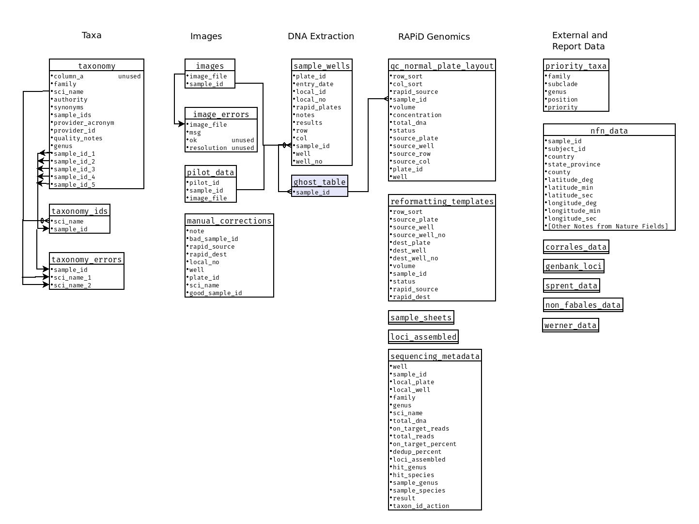

# NitFix Database Schema
- This does not include temporary tables or single tables for loading data or creating reports
- I did not make assumptions about the data. Everything in an input source is put into the database.
- Sample is an overused word here:
    - sample_id refers to the ID attached to the physical sample taken from the museum specimen and placed into the envelope.
    - sample plate refers to the 96-well plates used during the initial DNA extraction.
- This database only stores links (paths) to the images, and it does not store any sequence data.
- I try to audit for data problems and store the results in error tables.
- **The sample_id is used to track a sample all the way through the system.**

## Taxa tables
These are tables that store the taxonomy of interest to the study. It includes most taxa related to nitrogen fixation, and a targeted set of out-groups. When researchers take sample cuttings and pictures of those samples they put the sample ID on the envelope into the sample_ids field.

### taxonomy table
- There may be more than one sample per species, and these samples may be taken from different herbaria.
- sample_id_1 to 5 are the split of the sample_ids field.

column_a|family|sci_name|authority|synonyms|sample_ids|provider_acronym|provider_id|quality_notes|genus|sample_id_1|sample_id_2|sample_id_3|sample_id_4|sample_id_5
---|---|---|---|---|---|---|---|---|---|---|---|---|---|---
kew-2640309|Anisophylleaceae|Anisophyllea myriosticta|Floret| |07d218c6-2eaa-4308-917b-6598cd575d46|MO| | |Anisophyllea|07d218c6-2eaa-4308-917b-6598cd575d46| | | | 
kew-2640314|Anisophylleaceae|Anisophyllea polyneura|Floret| |7cdcbcc-2cc8-463a-b550-d7718d17cd49|MO| | |Anisophyllea|7cdcbcc-2cc8-463a-b550-d7718d17cd49| | | | 
kew-2640316|Anisophylleaceae|Anisophyllea purpurascens|Hutch. & Dalziel| |0d31695e-7b2b-416f-80a1-1480cccc845a|NY|3379302| |Anisophyllea|0d31695e-7b2b-416f-80a1-1480cccc845a| | | | 
kew-2732356|Anisophylleaceae|Combretocarpus rotundatus|(Miq.) Danser|Combretocarpus motleyi|07d26619-51e6-4f9f-9124-f2b168687810|MO| | |Combretocarpus|07d26619-51e6-4f9f-9124-f2b168687810| | | | 
kew-2644242|Apodanthaceae|Apodanthes caseariae|Poit.|Apodanthes flacourtiae, Apodanthes roraimae|0d41a40b-1669-418e-8b4b-31e648451c26|NY|3379308| |Apodanthes|0d41a40b-1669-418e-8b4b-31e648451c26| | | | 

### taxonomy_ids table
This is a way of easily linking the species with the sample_id. It's derived from the sample_id_1 to 5 fields.

sci_name|sample_id
---|---
Anisophyllea myriosticta|07d218c6-2eaa-4308-917b-6598cd575d46
Anisophyllea polyneura|7cdcbcc-2cc8-463a-b550-d7718d17cd49
Anisophyllea purpurascens|0d31695e-7b2b-416f-80a1-1480cccc845a
Combretocarpus rotundatus|07d26619-51e6-4f9f-9124-f2b168687810
Apodanthes caseariae|0d41a40b-1669-418e-8b4b-31e648451c26

### taxonomy_errors table
Sometimes people turn off error corrections and enter the same sample_id for multiple species. This tracks that rare error.

sample_id|sci_name_1|sci_name_2
---|---|---
00a0afb5-d49b-465d-8b96-94477cc86ed5|Calliandra comosa|Paratrophis asutraliana
00a71fdb-49de-416c-9d67-77afab12e6d7|Adesmia horrida|Streblus elongatus
00b2cee6-2c92-4a2d-a3bc-f8fe1bcaac80|Pomaderris ovaria|Pomaderris phylicifolia
00b5bc69-ec69-433a-a4e9-27e9ce6f5831|Parartocarpus venenosa|Pomaderris prunifolia
0eb57a98-18e6-4d6b-ba5f-6443d2640f7c|Ficus cerasicarpa|Crataegus aurantia

## Image tables

These are used to link a sample with its image file.

### images table

The contains the actual link from an image to the sample. We don't store images in the database just paths to the image file.

image_file|sample_id
---|---
CAS-DOE-nitfix_specimen_photos/R0000020.JPG|c5a5904a-0c3e-42e2-be0e-d265ed90690f
CAS-DOE-nitfix_specimen_photos/R0000021.JPG|c5979f39-0f5e-42a2-9f92-b4b364210f3d
CAS-DOE-nitfix_specimen_photos/R0000022.JPG|c593f78f-a012-4d8e-ab4e-50ebab84c122
CAS-DOE-nitfix_specimen_photos/R0000023.JPG|c5929b62-e137-4268-b76a-d0ceb7a4b36e
CAS-DOE-nitfix_specimen_photos/R0000024.JPG|c582db12-83be-49a9-ba5b-78d3983902b7

### image_errors table
We cannot scan all images for QR-codes for various reasons. This tracks those errors. Because there were few errors in unimportant species we did not try to resolve the errors, so, the "OK" and "resolution" fields are not used.

image_file|msg|ok|resolution
---|---|---|---
CAS-DOE-nitfix_specimen_photos/R0002381.JPG|MISSING: QR code missing in CAS-DOE-nitfix_specimen_photos/R0002381.JPG|0.0|
CAS-DOE-nitfix_specimen_photos/R0002641.JPG|MISSING: QR code missing in CAS-DOE-nitfix_specimen_photos/R0002641.JPG|0.0|
DOE-nitfix_specimen_photos/R0000835.JPG|MISSING: QR code missing in DOE-nitfix_specimen_photos/R0000835.JPG|0.0|
CAS-DOE-nitfix_specimen_photos/R0000614.JPG|"DUPLICATES: Files CAS-DOE-nitfix_specimen_photos/R0000614.JPG and 581    CAS-DOE-nitfix_specimen_photos/R0000613.JPG Name: image_file, dtype: object have the same QR code"| | 

### pilot_data table

We needed to roll the data from the pilot study into this database.

pilot_id|sample_id|image_file
---|---|---
ny: cronquist 11617|2179dce7-dac2-4fc1-84a3-8725acefa8cc|UFBI_sample_photos/20170523_154701.jpg
ny: nee 38556|00420ba6-4228-49e8-845c-30a967de4b51|UFBI_sample_photos/20170523_154645.jpg
ny: jorengensen 65676|72b64a1e-0dd9-4f44-9f82-afaee163d57b|UFBI_sample_photos/20170523_154638.jpg
ny: jaramillo 10160|3364f3bb-c0a1-4af4-8b3b-a780de9f1594|UFBI_sample_photos/20170523_154629.jpg
ny: jorgensen 61589|6e76a0be-4b0f-4e01-a6e6-1cd1395d4458|UFBI_sample_photos/20170523_154621.jpg

### manual_corrections table

The best explanation is summed up in the [fix_sample_ids.py](../nitfix/fix_sample_ids.py).

note|bad_sample_id|rapid_source|rapid_dest|local_no|well|plate_id|sci_name|good_sample_id
---|---|---|---|---|---|---|---|---
Tingshuang|03dcc788-a34c-45a1-849b-3d8c13b6b919|FMN_131002_P095_WD01|FMN_131001_P052_WH02|Rosales_0031|B11|ad147b30-56bd-4650-a47d-e17ebbb75536| | 
Tingshuang|03da3f38-b02f-4aa5-a9c1-5d01ebcd472f|FMN_131002_P095_WD02|FMN_131001_P052_WH03|Rosales_0031|B10|ad147b30-56bd-4650-a47d-e17ebbb75536| | 
 |f7bc2efa-1512-46c1-8104-d2d8ec869a4b|FMN_131002_P018_WG10|FMN_131001_P083_WG12|Nitfix_0028|G10|1c67bdc8-366a-4e92-83e7-c3260afd7b8b|Astragalus peduncularis|f7bc2efa-1512-46c1-8104-d2de8c869a4b
 |f8b62d6c-fca9-4c5d-8099-e1325093fb36|FMN_131002_P018_WG12|FMN_131001_P083_WH01|Nitfix_0028|G12|1c67bdc8-366a-4e92-83e7-c3260afd7b8b|Cajanus crassus|f8b62d6c-fca9-4c5d-8909-e1325093fb36
 |0d628c0c-f882-49dc-99c7-25865b33e2dc|FMN_131002_P026_WB10|FMN_131001_P086_WC06|Nitfix_0033|B10|259e2815-061b-4287-9c1a-aab7472482c3|Aeschynomene nilotica|0d628c0c-f882-49dc-99c7-25865b332edc

## DNA extraction tables

### sample_wells table

This is where the samples from the envelopes are processed in 96-well plates to extract DNA.  Note that a sample may be processed more than once if there are issues with the initial extraction.

plate_id|entry_date|local_id|local_no|rapid_plates|notes|results|row|col|sample_id|well|well_no
---|---|---|---|---|---|---|---|---|---|---|---
031fc196-3587-477d-8bd2-4a9f5167be4d|2018-01-18|Local identifier:NITFIX_3|Nitfix_0003|FMN_131002_P082-G-H|Notes: OSU SAMPLES, Row C unsent|Quantification 3/5|A|1|ade73b3b-79de-407d-b9d2-6c4f850309bc|A01|1
031fc196-3587-477d-8bd2-4a9f5167be4d|2018-01-18|Local identifier:NITFIX_3|Nitfix_0003|FMN_131002_P082-G-H|Notes: OSU SAMPLES, Row C unsent|Quantification 3/5|A|2|a4428f60-f696-4038-8805-ae1fd338c88b|A02|2
031fc196-3587-477d-8bd2-4a9f5167be4d|2018-01-18|Local identifier:NITFIX_3|Nitfix_0003|FMN_131002_P082-G-H|Notes: OSU SAMPLES, Row C unsent|Quantification 3/5|A|3|aad60e48-6c79-4290-8049-166fc773b9b1|A03|3
031fc196-3587-477d-8bd2-4a9f5167be4d|2018-01-18|Local identifier:NITFIX_3|Nitfix_0003|FMN_131002_P082-G-H|Notes: OSU SAMPLES, Row C unsent|Quantification 3/5|A|4|af311575-c54f-4069-98bf-95c99c6796c3|A04|4
031fc196-3587-477d-8bd2-4a9f5167be4d|2018-01-18|Local identifier:NITFIX_3|Nitfix_0003|FMN_131002_P082-G-H|Notes: OSU SAMPLES, Row C unsent|Quantification 3/5|A|5|afc68f65-f826-4710-8e76-1427cb958ab4|A05|5

### ghost_table (A cautionary tale.)

There are many good reasons for not submitting the entire original 96-well plate (in sample_wells) for sequencing. DNA yield, or species coverage are just two. However, the lab technicians replated the sample_wells without tracking that information. There is some very incomplete tracking in the sample_wells.rapid_plates column. You will see some extreme hacking in [normal_plate_layout.py](../nitfix/lib/normal_plate_layout.py) of me trying to figure out what samples went where. I was able to use the fact that the technicians always used multi-pipetters to transfer the samples, and so I could use sequences of UUIDs to figure out where the samples came from.

## RAPiD Genomics tables

RAPid Genomics sequences the DNA. In their pipeline they replate the samples a few times. They do keep track of what went where, so it is not too difficult to figure out. I really don't have much to say except that the data was tracked and showed up in reports.

## External and Report Data tables

These are mostly one-off tables. Some of them were ingested but not even used by me. There are two tables that are worth noting.

### priority_taxa

This is used to select which taxa are most important for sequencing. There are also some [rules](rules_dna_extracts.md) we used in addition to this table for selecting the most important samples send to RAPiD for sequencing.

family|subclade|genus|position|priority
---|---|---|---|---
Elaeagnaceae||Elaeagnus|Fixer|High
Elaeagnaceae||Hippophae|Fixer|High
Elaeagnaceae||Shepherdia|Fixer|High
Barbeyaceae||Barbeya|Sister|High
Rhamnaceae|Colletieae|Adolphia|Fixer|High

### nfn_data

This data is surprisingly useful. It contains information [citizen scientists](https://www.zooniverse.org/organizations/md68135/notes-from-nature) extracted from the images. It is mostly information from the labels on the herbarium specimens.

sample_id|subject_id|country|state_province|county|location|minimum_elevation|maximum_elevation|main_dropdown|latitude_deg|latitude_min|latitude_sec|longitude_deg|longitude_min|longitude_sec|primary_collector_last_first_middle|other_collectors_as_written|collector_number_numeric_only|collector_number_verbatim|month_1|day_1|year_1|month_2|day_2|year_2|subject_resolved_name|subject_image_name|subject_nybg_bar_code|workflow_id|habitat_description|subject_provider_id|collected_by_first_collector_last_name_only|collector_number|subject_file_name|subject_image_file|subject_scientific_name|scientific_name|subject_manifest_file|collection_no|collected_by|last_name
---|---|---|---|---|---|---|---|---|---|---|---|---|---|---|---|---|---|---|---|---|---|---|---|---|---|---|---|---|---|---|---|---|---|---|---|---|---|---|---|---
8e37959f-dfa6-44b6-a201-b94215340016|16192935|United States of America|North Carolina|Wayne|Town of Fremont, along NC Rt.222, east of Evans Farm Road, growing along roadside ditch.|||feet|35|32|52.71|- 77|59|01.95|Longbottom, Wayne D.||16,167||9 - September|25|2011||||Senna obtusifolia|R0001220.JPG|NYBG 3196996|5657||||||||||16,167|Longbottom, Wayne D.|Longbottom
90a9d5ee-a1c6-4dd3-b6b1-6932ea796abd|16192937|United States of America|Arizona|Maricopa|Salt Rivr at 35th Avenue bridge in Phoenix, just downstream from storm water/effluent drain with periodic large pulses of discharge; riparian, growing along terrace above storm drain, plant community of sedges, cattail, and other wetland species.|1022||feet|33.411913|||- 112.133472|||Makings, Liz|Dustin Wolkis, Julie Stromberg, Heather Bateman|3869||1 - January|21|2012||||Senna artemisioides|R0001205.JPG|NYBG 3196995|5657||||||||||3869|Makings, Liz|Makings
90f68e06-c5cb-48dc-9de1-5c0512314486|16192938|Gabon|Ogooué-Lolo||Makande surroundings, c. 65 km SSW of Booué. In forest.||||- 0|41 S||11|55 E||Breteler, F. J.|G. Caballé; Y. Azizet Issembé; J.-M. Moussavou; O. Pascal; R.H.M.J. Lemmens & M.S.M. Sosef|15011||2 - February|11|1999||||Scorodophloeus zenkeri|R0001202.JPG|NYBG 3196994|5657||||||||||15011|Breteler, F. J.|Breteler
90fb8362-a4ed-407d-a8b1-32dc56506101|16192939|Tanzania, United Republic of|Tanga||Mkaramo Parish, Mkwaja Subchiefeom, Mwera Chiefdom, Pangani Diestrict|150||feet|||||||Tanner, R. E. S.|Zigua: Mhande|3597||7 - July|10|1957||||Scorodophloeus fischeri|R0001201.JPG|NYBG 3196992|5657||||||||||3597|Tanner, R. E. S.|Tanner
911525c9-04f7-4213-8781-a9842216c2d8|16192941|Congo (Democratic Republic of the)|Kasaï-Central||Babadi - Kasai|||unknown|||||||Gillardin||125||12 - December|Not Shown|1934||||Leonardoxa romii|R0001199.JPG|NYBG 3196991|5657||||||||||125|Gillardin|Gillardin
